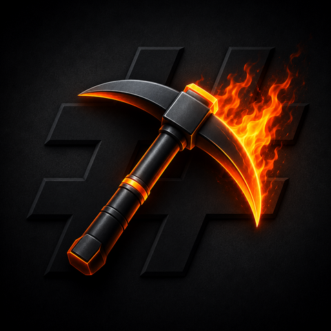

<p align="center">
  
</p>

# Pickhash

**Rent Bitcoin hashrate on your own terms.**

Pickhash rents SHA256 AsicBoost or Blake2B Siacoin hashrate from [miningrigrentals.com](https://www.miningrigrentals.com) and
points it at *your* stratum endpoint — typically your own Bitcoin node behind a Datum Gateway — so the
hashrate you pay for mines *your* block templates.

You work with three linked numbers — **how much you want to spend**, **how much hashrate you want**, and
**for how long** — and Pickhash handles the rest: finding reliable rigs, pricing, creating the rentals,
pointing them at your pool, and watching over everything (ramp-up, underdelivery, offline rigs, refunds).

> **Status:** in active development toward v1.0. Not yet released.

---

## Running Pickhash

Pickhash runs on three platforms. Full setup instructions live in each section below.

### StartOS

Download the package for your StartOS version from the
[Releases](https://github.com/paulscode/pickhash/releases) page:

- **StartOS 0.3.5.x** → `pickhash-0351.s9pk`
- **StartOS 0.4.x** → `pickhash-040.s9pk`

In your StartOS dashboard, use the **Sideload** feature to upload the `.s9pk`.
Each package bundles both `x86_64` and `aarch64`, so one file works on any
StartOS device. Once installed, open the Pickhash dashboard and follow the setup
wizard — see [instructions.md](instructions.md) for the in-app setup notes.

Optionally install [HashGG](https://github.com/paulscode/hashgg) as well, to
auto-discover your public stratum endpoint.

### Umbrel

Pickhash is published through the **PaulsCode.Com** community app store:

1. In your Umbrel dashboard, open **App Store**.
2. Click the ellipsis (⋯) in the upper-right → **Community App Stores**.
3. Add this URL: `https://github.com/paulscode/umbrel-store`
4. Open the **PaulsCode.Com** store and install **Pickhash**.

If you also run the [HashGG](https://github.com/paulscode/hashgg) app, Pickhash
auto-discovers your endpoint; otherwise enter one manually during setup.

### Docker

```sh
docker compose up -d --build
```

Then open <http://localhost:3030> and follow the setup wizard. Your data —
including your encrypted marketplace credentials — lives in `./data`; protect it
(see [Security](#security) below).

---

## How it works

See [docs/how-it-works.md](docs/how-it-works.md) for a plain-language walkthrough for non-technical users.

## Contributing

Pickhash is open source (MIT) and built to be evolved by a community. If you'd like to contribute, start
with [CONTRIBUTING.md](CONTRIBUTING.md) for the development setup, and [docs/architecture.md](docs/architecture.md)
for how the system is put together. Security reports: see [SECURITY.md](SECURITY.md).

## Security

Pickhash spends real Bitcoin, so a few properties are worth stating plainly:

- **A dashboard password is required before the engine can spend.** DRY-RUN (rehearsal, no spend)
  works without one; switching to LIVE requires a password (on StartOS it's set from the service's
  config screen). Failed logins share a persisted, global rate-limit.
- **Marketplace credentials are encrypted at rest** (AES-256-GCM) with a key held outside the
  database, and are never logged. The app talks only to the marketplace over HTTPS.
- **Backups — read this:** on StartOS the encryption key is stored *inside* the backed-up volume,
  so the at-rest encryption does **not**, by itself, protect a stolen StartOS backup — the real
  protection there is StartOS's own backup encryption (your master password). Keep it safe. On the
  Docker path, protect your `data/` directory (it holds the key + the encrypted credentials).

## License

[MIT](LICENSE) © 2026 Paul Lamb
